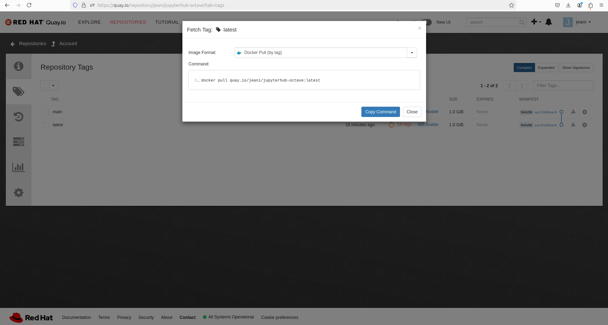
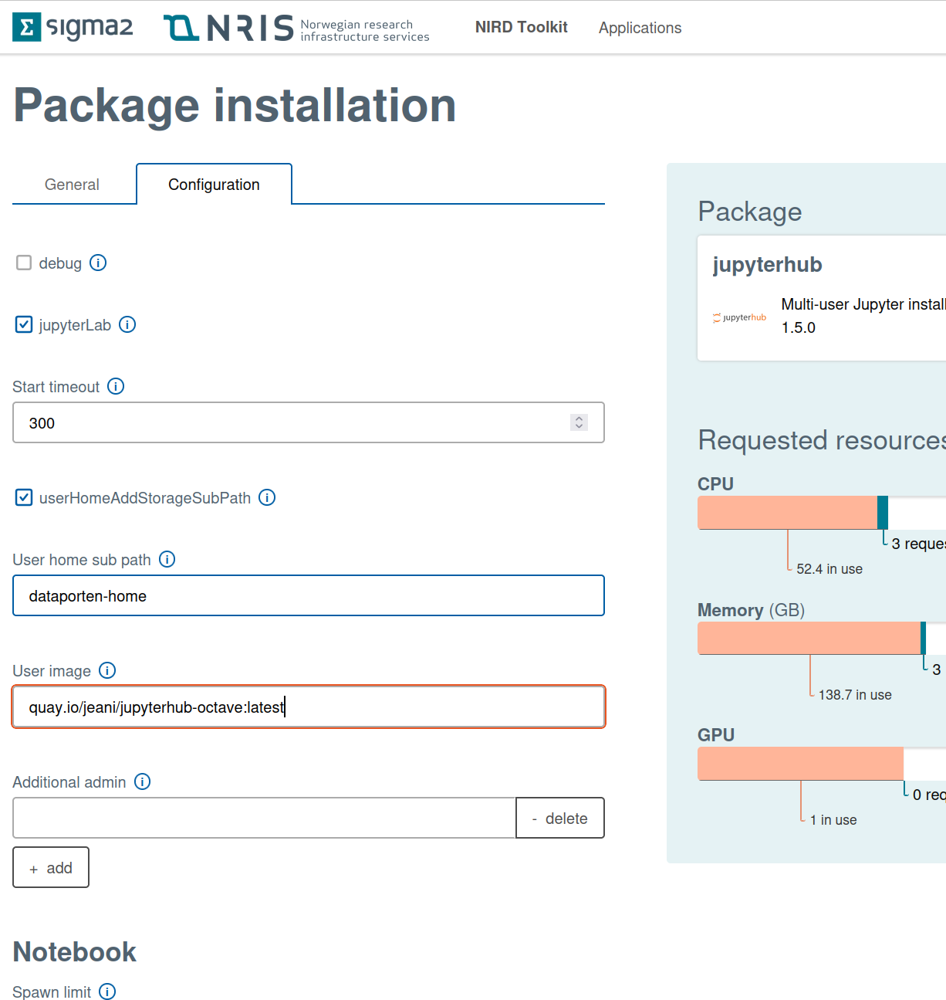
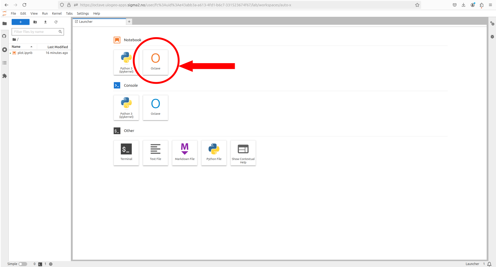
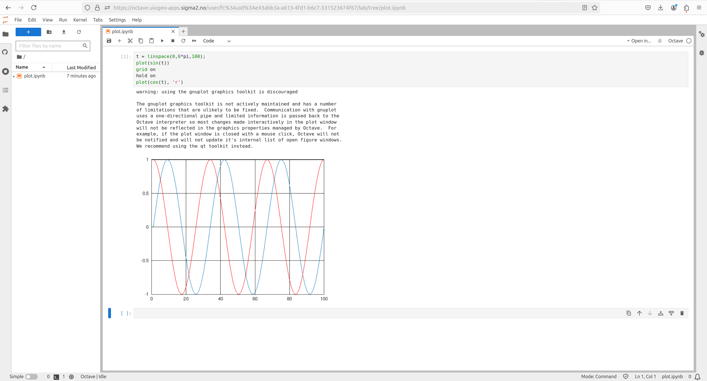

# jupyterhub-singleuser-base-notebook-octave

This is a Dockerfile for a Jupyterhub (singleuser-base-notebook) with an additional Octave kernel (version 0.36.0) running GNU Octave (version 6.4.0)

The container is built automatically on https://quay.io/repository/jeani/jupyterhub-octave 

and the corresponding image can be used directly in the Nird Service Platform (https://documentation.sigma2.no/nird_toolkit/overview_nird_toolkit.html)

When the Jupyterhub starts simply select the Octave kernel for notebook (or console)

and here is an example of notebook execution:

